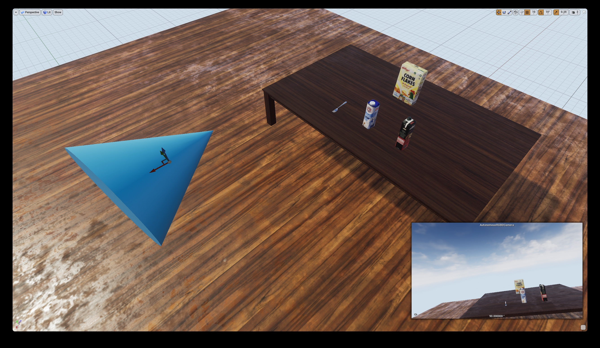
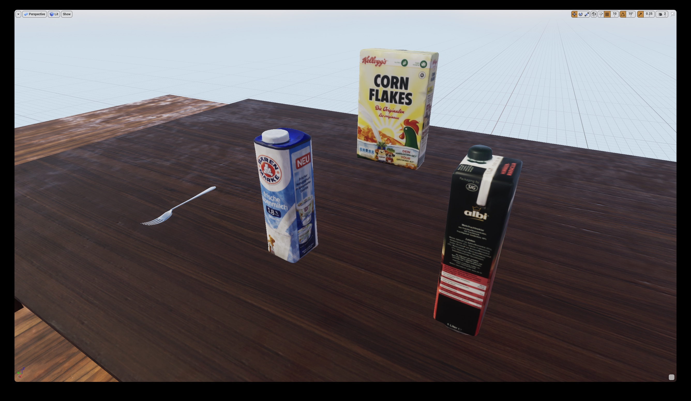
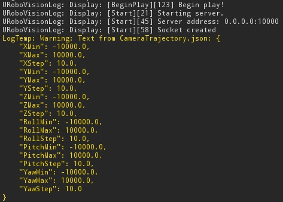
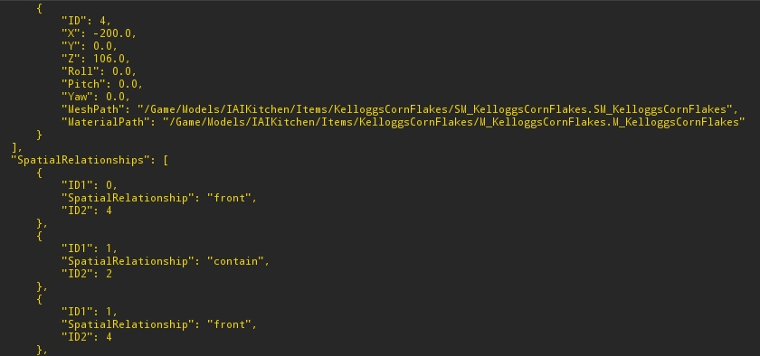
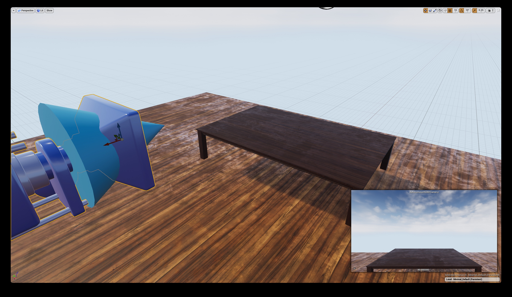
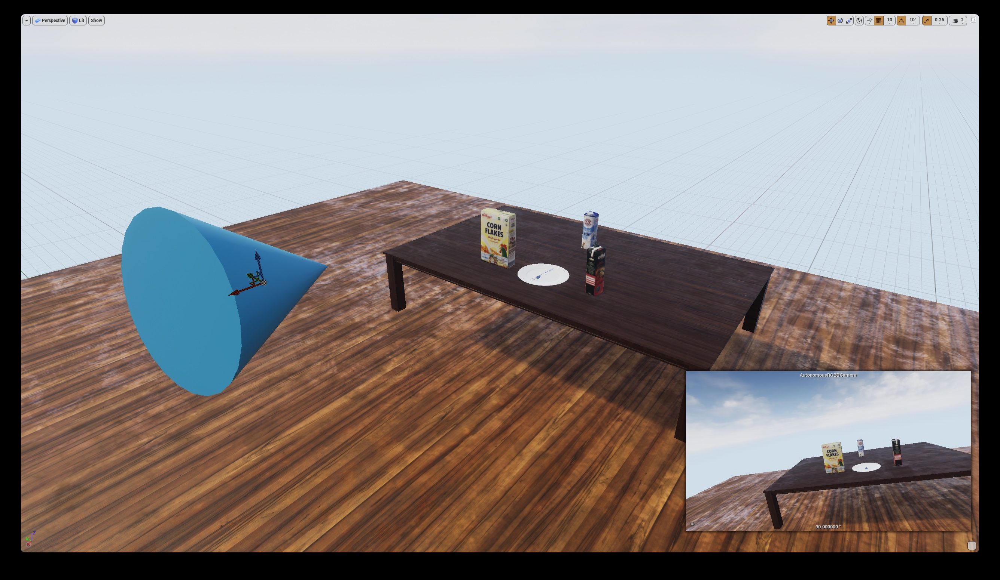
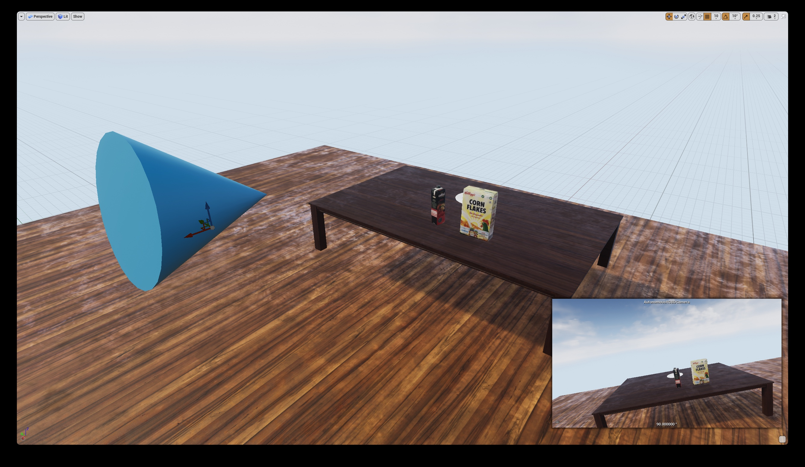

# AutonomousRGBDCamera

An autonomous RGB-D camera which creates and modifies environments in Unreal Engine. Both RGB-D and annotation data are captured and published via TCP. An [Unreal Engine to ROS bridge](https://github.com/mschaecke/Bridge-For-AutonomousRGBDCamera) is available.

A thesis elaborating the project can be requested at the [Faculty of Mathematics and Computer Science](https://www.uni-bremen.de/en/open-campus/program/tents/faculty-3-mathematics-and-computer-science) at the [University of Bremen](https://www.uni-bremen.de/en/). It includes the theoretical background, architecture and evaluation.

# Demonstration

AutonomousRGBDCamera placed in a simple test environment for demonstration purposes:

Four scene objects photo-realistically rendered in UE4:

The content of CameraTrajectory.json after it is successfully loaded in UE4 via CameraTrajectory:

Specifications used by SceneConfiguration. A scene object is specified in the upper half and spatial relationships in the lower one:

Initially, only AutoRGBDCamera is placed in the level by the user:

Scene objects are spawned and both the camera and objects are modified automatically during the first tick. RGB-D and annotation data are captured and published via TCP:

Subsequent ticks repeat this process:

# Usage

* Ensure the correct Unreal Engine version (4.22.3) is used. Other versions might work properly but were not tested.
* Add the plugin to the project (e.g MyProject/Plugins/AutonomousRGBDCamera).
* Add CameraTrajectory.json and SceneConfiguration.json to the project's config directory (e.g MyProject/Config).
* Modify the config files.
* Place AutoRGBDCamera in the level.
* Set the parameters in the "Details" tab.
* Start the synthetic data generation via the "Play" button.
* Use the [Unreal Engine to ROS bridge](https://github.com/mschaecke/Bridge-For-AutonomousRGBDCamera) to publish the data as ROS topics.

# Credits

Based on the [URoboVision](https://github.com/robcog-iai/URoboVision) project.
